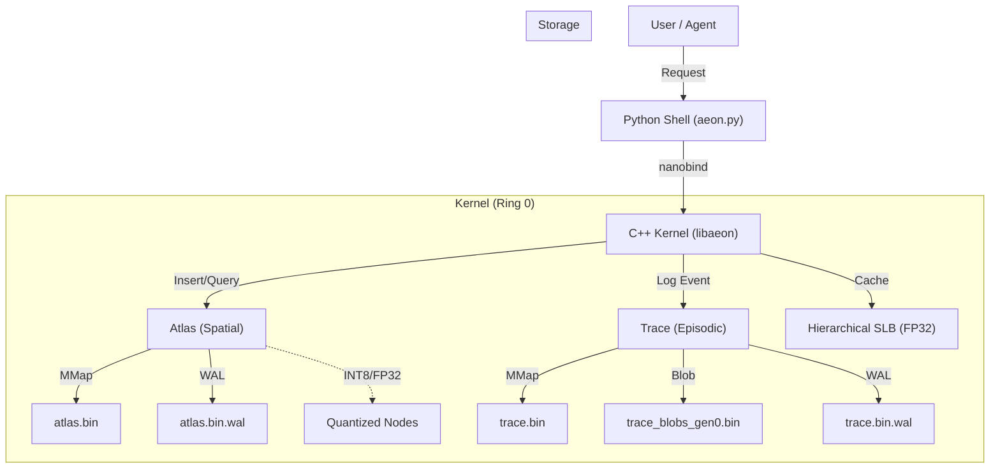

# Aeon Memory OS

[](https://github.com/aeon-ag/aeon)
[](https://github.com/aeon-ag/aeon/releases)
[](LICENSE)

**Aeon** is a persistent, crash-recoverable **Semantic Memory Engine** for AI agents, game engines, and robotics. It provides a shared memory substrate where thousands of independent agents — or a single massively parallel system — can *remember, retrieve, and forget* knowledge in real time.

> **V4.1 Frontier Release:** Write-Ahead Log for crash recovery, Sidecar Blob Arena for unlimited text storage, and INT8 Scalar Quantization for 3.1× file compression with 5.6× math speedup.

---

## Key Features

| Feature | Description |
|---|---|
| **Dual-Layer Memory** | Combines **Atlas** (Spatial Index) for concepts and **Trace** (Episodic Log) for experiences. |
| **Dynamic Dimensionality** | Single binary supports any embedding dim (384, 768, 1536) via runtime stride calculation. |
| **Write-Ahead Log (WAL)** | Crash-recoverable durability with < 1% insert overhead via 3-step lock ordering. |
| **INT8 Scalar Quantization** | 3.1× file compression (440MB → 141MB) with 4.70ns NEON SDOT dot product (5.6× vs FP32). |
| **Sidecar Blob Arena** | Unlimited text storage for Trace events with 64-byte inline preview and generational GC. |
| **Zero-Copy Architecture** | Mmap-backed C++ kernel with direct zero-copy bindings to Python (`nanobind`). |
| **Shadow Compaction** | "Redis-style" stutter-free garbage collection for 60 FPS real-time apps. |
| **Multi-Tenant C-API** | Strictly typed, session-routed C interface for Unity, Unreal, and Godot. |
| **Hierarchical SLB** | Sharded Semantic Lookaside Buffer (L1/L2) handling 100,000+ concurrent sessions. |
| **Trace Block Index** | Sub-linear `O(|V|/1024)` search over episodic history using block centroid scanning. |

---

## Architecture



---

## Quick Start

### Prerequisites

- CMake 3.25+
- C++23 Compiler (Clang 16+, GCC 13+, MSVC 19.34+)
- Python 3.10+

### Build from Source

```bash
# Clone repository
git clone https://github.com/aeon-ag/aeon.git
cd aeon

# Configure and build (Development Preset)
cmake --preset dev
cmake --build build/dev --parallel
```

### Python Usage

```python
import aeon

# 1. Open an Atlas (768-dim, INT8 quantized, WAL enabled)
atlas = aeon.Atlas("memory/atlas.bin", dim=768)

# 2. Insert detailed knowledge
node_id = atlas.insert(
    vector=[0.1, 0.5, ...], 
    metadata="The mitochondrion is the powerhouse of the cell."
)

# 3. Search (Navigate)
results = atlas.navigate(
    query=[0.1, 0.4, ...], 
    top_k=5
)
print(f"Nearest concept: {results[0].metadata}")
```

---

## C-API Example

Aeon provides a stable ABI for integration with game engines.

```c
#include "aeon_c_api.h"

int main() {
    // V4.1: INT8 quantization + WAL
    aeon_atlas_options_t opts = {
        .dim = 768,
        .quantization_type = 1,  // INT8_SYMMETRIC
        .enable_wal = 1
    };
    
    aeon_atlas_t* atlas;
    aeon_error_t err = aeon_atlas_create_ex("game_memory.bin", &opts, &atlas);
    
    if (err == AEON_OK) {
        // Insert (FP32 auto-quantized to INT8 on disk)
        float vec[768] = { /* ... */ };
        uint64_t id;
        aeon_atlas_insert(atlas, 0, vec, 768, "NPC memory",
                          "npc-42", &id);
        
        // Navigate (INT8 SDOT beam search, FP32 SLB cache)
        aeon_result_node_t results[10];
        size_t count;
        aeon_atlas_navigate(atlas, vec, 768, 4, 0, "npc-42",
                            results, 10, &count);
        
        aeon_atlas_drop_session(atlas, "npc-42");
        aeon_atlas_destroy(atlas);
    }
    return 0;
}
```

---

## Performance

Benchmarks run on Apple M4 Max (16 cores, active cooling). Full report: [`reproducibility_benchmarks/master_metrics.txt`](reproducibility_benchmarks/master_metrics.txt).

### Core Latencies

| Operation | Latency | Notes |
|---|---|---|
| **Atlas Insert (FP32)** | 2.23 µs | 448K ops/sec |
| **Atlas Insert (INT8)** | 2.11 µs | 475K ops/sec |
| **WAL Overhead** | < 1% | 2.23µs with vs 2.23µs without |
| **SLB Cache Hit** | 3.56 µs | FP32 always, even INT8 Atlas |
| **Navigate (100K FP32)** | 10.5 µs | Beam search, dim=768 |
| **Navigate (100K INT8)** | 3.09 µs | 3.4× faster than FP32 |
| **EBR P99 Read** | 750 ns | 15-reader hostile contention |
| **Compaction Pause** | < 2 µs | Main thread stall |

### INT8 Quantization Impact

| Metric | FP32 | INT8 | Improvement |
|---|---|---|---|
| File Size (100K nodes) | 440 MB | 141 MB | **3.1× smaller** |
| SIMD Dot Product | 26.5 ns | 4.70 ns | **5.6× faster** |
| Navigate Latency | 10.5 µs | 3.09 µs | **3.4× faster** |
| Relative Error | — | 0.069% | Negligible |

### Scalability

| Nodes | Navigate (FP32) | Navigate (INT8) |
|---|---|---|
| 10K | 7.1 µs | 1.8 µs |
| 100K | 10.5 µs | 3.1 µs |
| 1M | 10.5 µs | — |

---

## Documentation

| Document | Description |
|---|---|
| [ARCHITECTURE.md](ARCHITECTURE.md) | System design, WAL protocol, Blob Arena, INT8 architecture decisions |
| [INTERNALS.md](INTERNALS.md) | Data structures, on-disk formats, SIMD kernels, WAL record layout |
| [CODE_WALKTHROUGH.md](CODE_WALKTHROUGH.md) | API walkthrough, insert/navigate lifecycles, integration examples |

---

## License

MIT License. See [LICENSE](LICENSE) for details.
